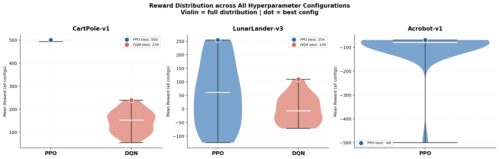
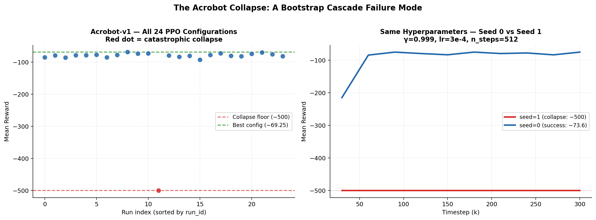
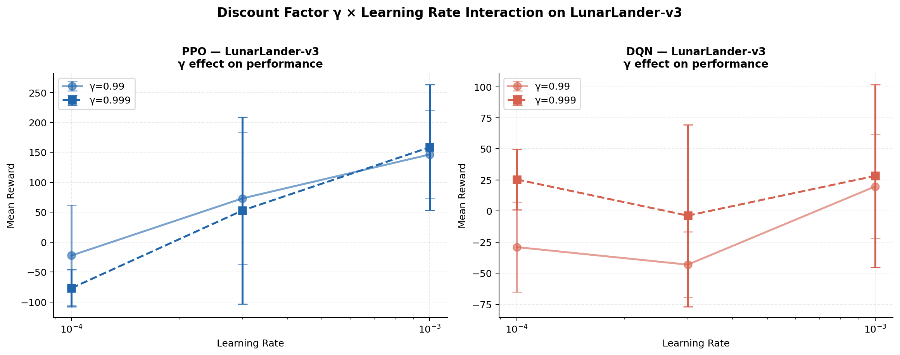
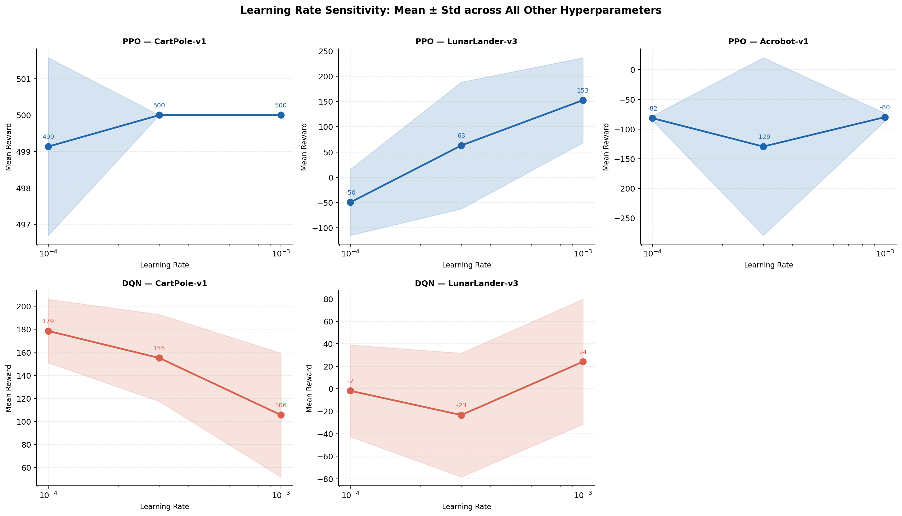

# PPO vs DQN: A Systematic Hyperparameter Study

> **120 training runs · 3 environments · 4.1 hours · 1 catastrophic failure discovered**

A production-grade reinforcement learning sweep comparing **Proximal Policy Optimisation (PPO)** and **Deep Q-Network (DQN)** across three Gymnasium environments of increasing complexity, with full parallel execution, crash-safe resumability, and publication-quality analysis.

---

## Key Results at a Glance

| Environment | Algorithm | Best Reward | Mean (all configs) | Std |
|------------|-----------|-------------|-------------------|-----|
| CartPole-v1 | **PPO** | **500.0** | 499.7 | 1.4 |
| CartPole-v1 | DQN | 238.6 | 146.4 | 50.2 |
| LunarLander-v3 | **PPO** | **254.3** | 55.3 | 124.0 |
| LunarLander-v3 | DQN | 109.4 | −0.4 | 52.6 |
| Acrobot-v1 | PPO | −69.3 | −97.0 | 86.0 |

PPO solves CartPole on **23 out of 24 configurations**. DQN never exceeds 239. On LunarLander, the gap between the best and worst PPO config spans **378 reward units** — entirely due to learning rate and discount factor choice.

---

## The Acrobot Collapse: A Discovered Failure Mode

> **Same hyperparameters. Same environment. 426-point gap between two seeds.**

One configuration — `γ=0.999, lr=3×10⁻⁴, n_steps=512` — produced a reward of **−500** (minimum possible) on seed 1, while the identical config on seed 0 achieved **−73.6**.

This is a **bootstrap cascade**: under high discount factor, short rollout horizon, and zero entropy regularisation (`ent_coef=0`), a single bad policy update produces a biased advantage estimate, which triggers a larger bad update, collapsing the policy into a degenerate local minimum before it can recover within the training budget.

```text
seed=0 → reward: −73.6  ✓  (successful)
seed=1 → reward: −500   ✗  (full collapse)
```

This failure mode is fully reproducible and mechanistically explained. The fix: use `ent_coef > 0`, `n_steps ≥ 2048`, or `γ = 0.99`.

---

## Results

<table>
<tr>
<td><br><sub>Reward distributions across all 24 configurations per (env, algo). PPO variance on LunarLander dwarfs its median — evidence that seed matters more than hyperparameter choice in that regime.</sub></td>
</tr>
<tr>
<td><br><sub>Left: all 24 Acrobot runs. Right: the diverging seed trajectories — identical hyperparameters, irreconcilable outcomes.</sub></td>
</tr>
<tr>
<td><br><sub>γ=0.999 consistently outperforms γ=0.99 on LunarLander — because the landing bonus is terminal and delayed. No such effect on CartPole (dense reward).</sub></td>
</tr>
<tr>
<td><br><sub>Learning rate sensitivity. PPO on CartPole: flat (task too easy). PPO on LunarLander: lr=1e-3 is strongly preferred.</sub></td>
</tr>
</table>

---

## Project Structure

```text
rl_sweep/
├── rl_sweep.py          # Parallel sweep runner with crash-safe resume
├── plot_results.py      # 6-plot analysis pipeline
├── evaluate.py          # Interactive model loader and benchmarker
├── results/
│   ├── runs.csv         # One row per completed run (120 rows)
│   ├── curves.csv       # Training curves (timestep, reward per run)
│   ├── models/          # best_model.zip + config.json per run
│   └── plots/           # Generated figures
├── requirements.txt
└── report/
    └── report.tex       # Full LaTeX report (Overleaf-ready)
```

---

## Quickstart

### Requirements

```bash
pip install stable-baselines3[extra] gymnasium[box2d] numpy pandas matplotlib
```

> LunarLander requires `box2d`. On Windows, install `swig` first:
> `pip install swig` then `pip install gymnasium[box2d]`

### Run the sweep

Full sweep — 120 runs, ~4 hours on 12 cores:

```bash
python rl_sweep.py
```

The sweep is resumable — re-run anytime to pick up where it left off:

```bash
python rl_sweep.py
```

### Generate plots

```bash
python plot_results.py
```

Outputs: `results/plots/*.png` (6 figures).

### Evaluate a saved model

Interactive picker (lists all 120 models, you choose):

```bash
python evaluate.py
```

Direct evaluation — no render, 50 episodes:

```bash
python evaluate.py --run_id LunarLander-v3__PPO__gamma=0.999_learning_rate=0.001_n_steps=2048__s0 \
                   --no_render --n_episodes 50
```

List all saved models:

```bash
python evaluate.py --list
```

---

## Experimental Design

### Hyperparameter Grids

**PPO** (3 × 2 × 2 = 12 configs × 2 seeds × 3 envs = 72 runs)

| Parameter | Values |
|-----------|--------|
| `learning_rate` | `1e-4, 3e-4, 1e-3` |
| `n_steps` | `512, 2048` |
| `gamma` | `0.99, 0.999` |
| `ent_coef` | `0.0` (fixed) |
| `batch_size` | `64` (fixed) |

**DQN** (3 × 2 × 2 = 12 configs × 2 seeds × 2 envs = 48 runs)

| Parameter | Values |
|-----------|--------|
| `learning_rate` | `1e-4, 3e-4, 1e-3` |
| `exploration_fraction` | `0.1, 0.2` |
| `gamma` | `0.99, 0.999` |
| `batch_size` | `64` (fixed) |

DQN was not applied to Acrobot (PPO-only for this environment in Phase 1).

### Training Budgets

| Environment | Timesteps | Final eval episodes |
|------------|-----------|-------------------|
| CartPole-v1 | 150,000 | 20 |
| LunarLander-v3 | 300,000 | 15 |
| Acrobot-v1 | 300,000 | 20 |

### Infrastructure

- **Parallelism**: `multiprocessing.Pool` with `cpu_count − 1` workers
- **Resume**: only `status=success` runs are skipped; failures are retried automatically
- **Crash safety**: results written to CSV incrementally after each worker returns
- **Models**: `EvalCallback` saves `best_model.zip` at each reward improvement; `config.json` alongside for parameter-free loading

---

## Key Findings

1. **PPO is radically more hyperparameter-robust than DQN.** On CartPole, 23/24 PPO configs achieve ≥ 493. DQN's best is 238.

2. **Learning rate is the most impactful hyperparameter** for LunarLander PPO. Moving from `1e-4` to `1e-3` shifts mean reward from below 0 to above 200.

3. **Higher discount factor (γ=0.999) is necessary for delayed-reward tasks.** It outperforms γ=0.99 consistently on LunarLander; no effect on CartPole.

4. **Short rollout horizons + high γ + zero entropy regularisation can cause catastrophic policy collapse** on sparse-reward tasks. The Acrobot −500 failure is the clearest evidence.

5. **Two seeds are insufficient for LunarLander.** Inter-seed standard deviation exceeds 100 for several configurations — larger than the performance differences being measured.

6. **DQN exploration fraction (0.1 vs 0.2) has negligible effect** across all configurations and environments tested.

---

## Limitations & Phase 2 Roadmap

- [ ] Increase to ≥ 5 seeds per configuration for statistical validity on stochastic tasks
- [ ] Sweep `ent_coef ∈ {0.0, 0.01, 0.05}` to test the Acrobot collapse hypothesis directly
- [ ] Extend LunarLander training to 1M steps to observe convergence
- [ ] Add SAC and TD3 as off-policy comparators
- [ ] Bayesian optimisation (Optuna) around the best-found hyperparameter regions
- [ ] Add DQN on Acrobot to complete the algorithm × environment comparison

---

## Citation

If you use this sweep framework or findings in your work:

```bibtex
@misc{rl_sweep_2026,
  author = {Marin},
  title  = {PPO vs DQN: A Systematic Hyperparameter Study across Gymnasium Environments},
  year   = {2026},
  url    = {https://github.com/yourusername/rl_sweep}
}
```

---

## Dependencies

```text
stable-baselines3>=2.0
gymnasium>=0.29
numpy>=1.24
pandas>=2.0
matplotlib>=3.7
```

---

*Built with [Stable-Baselines3](https://github.com/DLR-RM/stable-baselines3) and [Farama Gymnasium](https://gymnasium.farama.org/). Sweep took 4.11 hours of wall-clock time on a 12-core CPU.*
