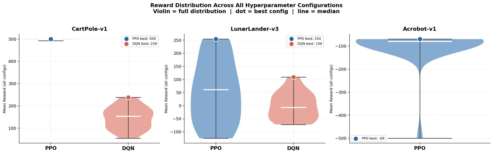
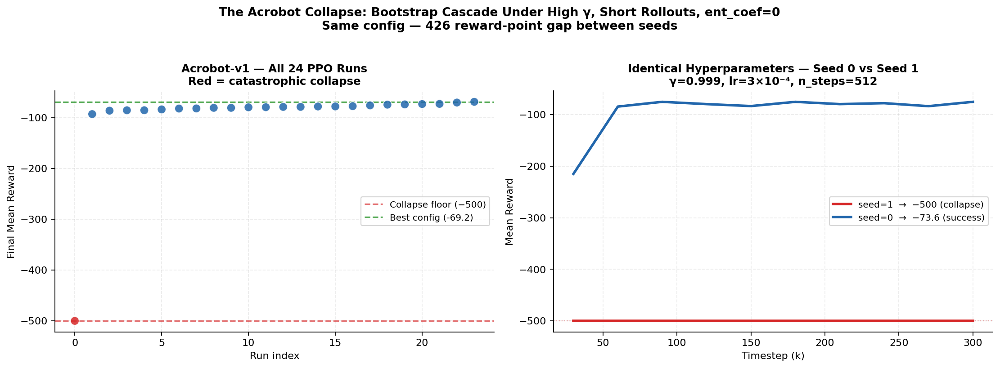
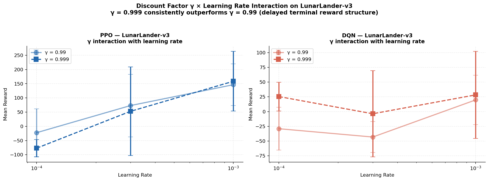

# PPO vs DQN: A Systematic Hyperparameter Study


> 120 training runs | 3 Gymnasium environments | 4.1 hours | one documented policy-collapse failure mode

This repository contains a reproducible reinforcement learning sweep comparing **Proximal Policy Optimization (PPO)** and **Deep Q-Network (DQN)** across Gymnasium environments. The project focuses on experiment infrastructure, reproducibility, hyperparameter sensitivity, and careful interpretation of failure modes.

The sweep runner supports parallel execution, crash-safe CSV resume, deterministic seed setup, generated plots, and a LaTeX report.

## Key Results

| Environment | Algorithm | Best reward | Mean reward | Std |
| --- | --- | ---: | ---: | ---: |
| CartPole-v1 | PPO | 500.0 | 499.7 | 1.4 |
| CartPole-v1 | DQN | 238.6 | 146.4 | 50.2 |
| LunarLander-v3 | PPO | 254.3 | 55.3 | 124.0 |
| LunarLander-v3 | DQN | 109.4 | -0.4 | 52.6 |
| Acrobot-v1 | PPO | -69.3 | -97.0 | 86.0 |

PPO achieves the maximum reward on 21/24 configurations; 23 of 24 configurations scored >= 493. DQN did not exceed 239 under the same training budget. LunarLander showed strong sensitivity to learning rate and discount factor. Acrobot exposed a policy-collapse failure in one PPO configuration.

These are empirical results for this grid, budget, and two-seed setup. They should be treated as directional findings, not universal algorithm rankings.

## Acrobot Collapse

One Acrobot PPO configuration produced a complete seed-dependent collapse:

```text
Config: gamma=0.999, learning_rate=3e-4, n_steps=512
seed=0 -> reward: -73.6   successful
seed=1 -> reward: -500.0  full collapse
```

The likely mechanism is a bootstrap cascade: high discount factor, short rollout horizon, and zero entropy regularization (`ent_coef=0`) make the value and advantage estimates vulnerable to early bad updates. In Phase 2, this hypothesis should be tested directly by sweeping `ent_coef`, increasing seeds, and comparing longer rollouts.

## Result Plots

| Plot | What it shows |
| --- | --- |
| `results/plots/01_violin_distributions.png` | Reward distributions across all configurations per env and algo. |
| `results/plots/02_seed_variance.png` | How much results vary across seeds for the same configuration. |
| `results/plots/03_lr_sensitivity.png` | Reward sensitivity to learning rate. |
| `results/plots/04_gamma_lr_lunar.png` | Gamma x LR interaction on LunarLander-v3. |
| `results/plots/05_acrobot_collapse.png` | The Acrobot seed divergence and collapse. |
| `results/plots/06_learning_curves.png` | Training curves: top 3 and worst config per algo and env. |







## Project Structure

```text
rl-sweep/
  src/
    rlsweep/
      __init__.py    package version
      config.py      shared constants (paths, grids, seeds)
      cli.py         unified CLI entry point (rl-sweep run/plot/evaluate)
      sweep.py       parallel sweep runner with crash-safe resume
      plot.py        plot generation and result summaries
      evaluate.py    saved-model discovery and evaluation helper
  results/
    runs.csv         one row per completed run (120 successful runs)
    curves.csv       training curve snapshots
    plots/           generated figures used in the README and report
  report/
    report.tex       LaTeX report source
  tests/
    test_results.py     pytest suite: validate headline metrics vs runs.csv
    test_sweep_logic.py fast unit tests for sweep functions (no SB3/gym)
  pyproject.toml     package metadata, dependencies, tool config
  Makefile           convenience targets: install, test, lint, format, sweep, plots, clean
```

Saved model artifacts are generated under `results/models/` when the sweep is run locally. They are intentionally not included in this repository because they can be large and are not needed to inspect the published results.

## Quickstart

Create an environment and install the package with development dependencies:

```bash
python -m venv .venv
. .venv/bin/activate
pip install -e ".[dev]"
```

On Windows, LunarLander may require SWIG before installing Box2D dependencies:

```bash
pip install swig
pip install -e ".[dev]"
```

Run the tests:

```bash
pytest
```

Generate plots from the included CSV outputs:

```bash
rl-sweep plot
# equivalent: python -m rlsweep.plot
```

Run or resume the full sweep:

```bash
rl-sweep run
# equivalent: python -m rlsweep.sweep
```

The full sweep is expensive: it runs 120 training jobs and took about 4.1 wall-clock hours on a 12-core CPU.

Evaluate a saved model after running the sweep locally:

```bash
rl-sweep evaluate --list
rl-sweep evaluate --run_id LunarLander-v3__PPO__gamma=0.999_learning_rate=0.001_n_steps=2048__s0 --no_render --n_episodes 50
```

## Experimental Design

### PPO grid

PPO was run on CartPole-v1, LunarLander-v3, and Acrobot-v1.

| Parameter | Values |
| --- | --- |
| `learning_rate` | `1e-4`, `3e-4`, `1e-3` |
| `n_steps` | `512`, `2048` |
| `gamma` | `0.99`, `0.999` |
| `ent_coef` | `0.0` fixed |
| `batch_size` | `64` fixed |

This gives 12 configurations per environment. With 2 seeds and 3 environments, PPO contributes 72 runs.

### DQN grid

DQN was run on CartPole-v1 and LunarLander-v3 only.

| Parameter | Values |
| --- | --- |
| `learning_rate` | `1e-4`, `3e-4`, `1e-3` |
| `exploration_fraction` | `0.1`, `0.2` |
| `gamma` | `0.99`, `0.999` |
| `batch_size` | `64` fixed |

This gives 12 configurations per environment. With 2 seeds and 2 environments, DQN contributes 48 runs.

### Training budgets

| Environment | Timesteps | Final evaluation episodes |
| --- | ---: | ---: |
| CartPole-v1 | 150,000 | 20 |
| LunarLander-v3 | 300,000 | 15 |
| Acrobot-v1 | 300,000 | 20 |

## Infrastructure

- Parallelism: `multiprocessing.Pool` with `cpu_count - 1` workers.
- Resume behavior: only `status=success` runs are skipped; failed runs are retried.
- Crash safety: results are appended to CSV after each worker returns.
- Seeds: Python `random`, NumPy, and PyTorch are seeded per run.
- Models: `EvalCallback` writes `best_model.zip` and `config.json` locally for each run.

## Limitations and Phase 2

- Two seeds are not enough for strong statistical claims on stochastic environments.
- The Acrobot collapse hypothesis should be tested directly by sweeping `ent_coef`.
- LunarLander should be rerun with more seeds and longer budgets before ranking configurations strongly.
- DQN was not evaluated on Acrobot in Phase 1.
- SAC and TD3 would be useful off-policy comparators in a broader study.

## Citation

```bibtex
@misc{rl_sweep_2026,
  author = {Daniel Marin},
  title  = {PPO vs DQN: A Systematic Hyperparameter Study across Gymnasium Environments},
  year   = {2026},
  url    = {https://github.com/Danielmarinn/rl-sweep}
}
```

## License

MIT. See [LICENSE](LICENSE).
